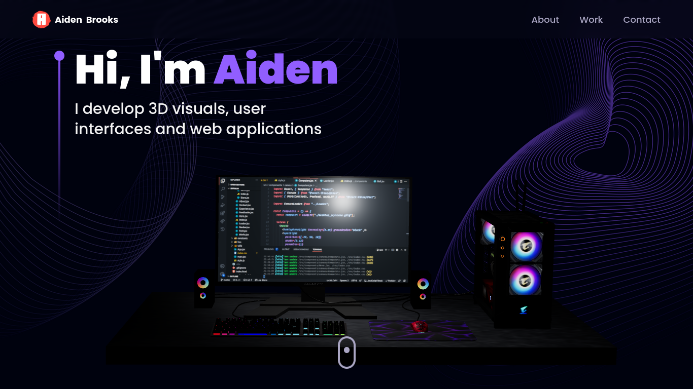

# Aiden Portfolio — Modern 3D Developer Portfolio


A modern, fully animated **3D developer portfolio** built with **React**, **Vite**, **TailwindCSS**, **Three.js**, and **@react-three/fiber**, featuring smooth 3D scenes, elegant animations, and a fully working EmailJS contact form.

---

## ✨ Overview

Aiden Portfolio is a sleek, production-ready 3D portfolio template designed for developers who want interactive visuals, professional animations, and a clean layout.

### You get:
- 🌐 3D animated models using **Three.js**
- 🌀 Smooth UI/UX animations using **framer-motion**
- 📩 Fully functional EmailJS contact form
- 📱 100% responsive design
- ⚡ Lightning‑fast performance powered by **Vite**

---

## 🖥️ Desktop Preview



---

## 📦 Tech Stack

### **Frontend**
- React 19  
- TypeScript  
- Vite 6  
- TailwindCSS 3.4  
- Framer Motion 12  

### **3D & Animation**
- Three.js  
- @react-three/fiber  
- @react-three/drei  
- maath  
- react-parallax-tilt  

### **Contact / Email**
- EmailJS (`@emailjs/browser`)

### **Helpers**
- prop-types  
- react-vertical-timeline-component  

---

## 🛠️ Getting Started

### 1. Clone Repository
```bash
git clone https://github.com/grep-many/aiden_portfolio.git
cd aiden_portfolio
```

### 2. Install Dependencies
```bash
npm install
```

### 3. Create Environment File
```env
VITE_EMAILJS_PUBLIC_KEY=your_public_key
VITE_EMAILJS_SERVICE_ID=your_service_id
VITE_EMAILJS_TEMPLATE_ID=your_template_id
VITE_TOEMAIL=your@email
```

### 4. Start Development Server
```bash
npm run dev
```

---

## 📁 Folder Structure

```
.
├── public
│   ├── desktop_pc          # 3D Computer model
│   └── planet              # 3D Planet model
├── src
│   ├── assets
│   ├── components
│   │   ├── canvas          # 3D Components
│   │   └── sections        # Page Sections
│   ├── constants
│   ├── hoc
│   ├── utils
│   ├── styles.ts
│   ├── App.tsx
│   └── main.tsx
└── vite.config.ts
```

---

## 🚀 Features

- 🌌 Interactive **Three.js 3D scenes**
- ⚡ Vite-powered performance
- 🎨 Tailwind utility-first design
- 🔁 Reusable components & animations
- 💬 EmailJS integration
- 📱 Fully responsive

---

## 📬 Contact Integration

Email functionality is powered by **EmailJS**:

```ts
import emailjs from "@emailjs/browser";

emailjs.send(
  serviceID,
  templateID,
  templateParams,
  publicKey
);
```

Just fill your `.env` values to make it work.

---

## 🧪 Scripts

```json
{
  "dev": "vite",
  "build": "tsc -b && vite build",
  "preview": "vite preview",
  "lint": "eslint ."
}
```

---

## 🪪 License

[](./LICENSE)

This project is open-sourced under the MIT License © 2025 Manish.